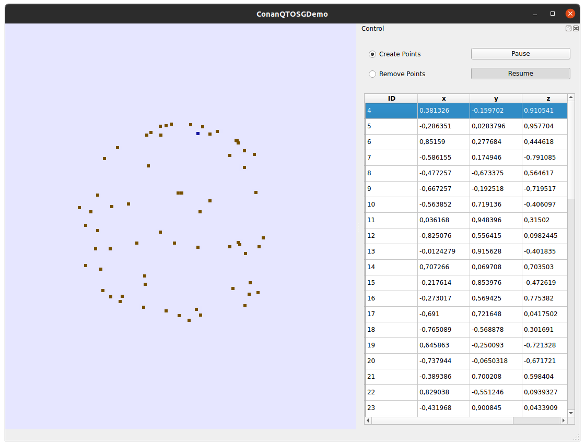
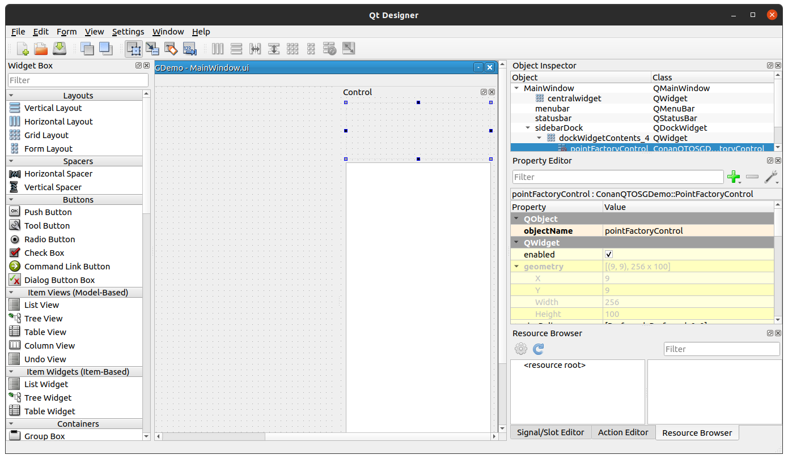

# ConanQtOSGDemo

This is a learning project of myself to explore how to integrate 
[OpenSceneGraph](http://www.openscenegraph.org/) into [Qt6](https://www.qt.io/product/qt6) 
for visualization purposes in computer vision research.

## Setup

The project uses [conan](https://conan.io/) and [CMake](https://cmake.org/) for 
dependency and build management, respectively.

Right now it is only tested on Ubuntu 20.04.

Starting in the root folder run the following commands:

```sh
conan create ./fontconfig_conanfile.py fontconfig/system@mwudenka/snapshot
mkdir -p build
cd build
conan install .. --build=missing
cmake ..
cmake --build .
cd ..
```

### Why creating a system fontconfig package?

As of writing the conan center recipe of fontconfig hardcodes the sysconfdir
to a path on the conan build server
(see [line 61](https://github.com/conan-io/conan-center-index/blob/38d85e32c8352c7faabf191901ac126ec1214f95/recipes/fontconfig/all/conanfile.py#L61)).
One way around that issue is to set the environment variable `FONTCONFIG_PATH`.
But that means that every user needs to know where fonts are stored on his machine.
That's why I created a recipe that installs (if not already available)
fontconfig using the system package manager (apt in that case) and
provides conan all paths important for linkage.

## Run

To execute the build result enter:

```sh
./build/bin/ConanQtOSGDemoExe
```

You should see a window appearing:



## What does it do

First, it demonstrates one possible integration of OSG into the 
[Qt6 Model-View-Delegate](https://doc.qt.io/qt-6/model-view-programming.html) 
pattern. Have a look at `src/models/QPointCloudModel.(h|cpp)` and
`src/models/QPointCloudView.(h|cpp)`. Some generic parts are extracted to
`src/utils/QOSGWidget.(h|cpp)`, `src/views/QAbstractOSGView.(h|cpp)`, 
`src/utils/QPickHandler.(h|cpp)` and `src/utils/PickableGeode.(h|cpp)` 
in the hope that they can be reused.
Sticking to the MVD standards makes it easy to use generic classes as the 
`QTableView` and `QItemSelectionModel`.

It also demonstrates how a UI can be modularized using 
[widget promotion](https://www.youtube.com/watch?v=LGzNWFHUvpM). 
That way `ui/PointFactoryControl.ui` is imported into `ui/MainWindow.ui`.

Such an ui file can be edited using the Qt Designer:



## Development

I recommend using CLion with the 
[conan addon](https://plugins.jetbrains.com/plugin/11956-conan).
